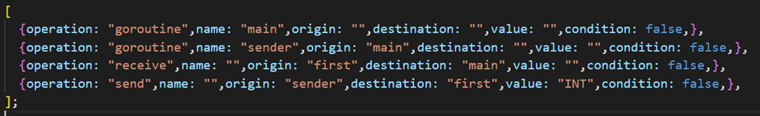
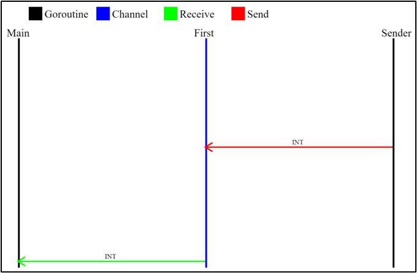

# go-ConVis
#### This is an application that visualises how the Go programming language handles concurrency
#### The visualisations consist of goroutines, channels and the values that are sent over the channels.
## Installation and Usage
First install the Go dependencies:

    go install
In the Frontend folder install the npm dependencies

    npm install
Build the go binary using: 
    
    go build

Execute the binary with the program file path as arguments e.g.,:

    ./First data/simple.go

Run the frontend server (in the frontend folder):

    npm run dev
## Description
The application performs a static analysis on the programs and generates a JSON object representation of the goroutines, channels and values being sent over the channels.

The Frontend visualisations is done using the [Pixi.js](https://pixijs.com/) framework

## Visualisations
Below is the visualisation of the simple.go program found in the examples folder

## Dependencies
* [Gorilla Mux](https://github.com/gorilla/mux)
* [Tesify](https://github.com/stretchr/testify)
* [Pixi.js](https://pixijs.com/)
* [Vite.js](https://vitejs.dev/)
* [Axios](https://axios-http.com/)
